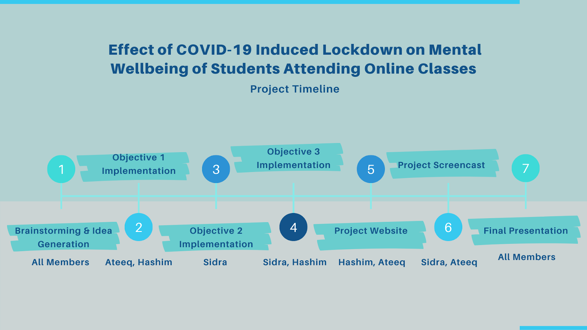

\newpage

# **DATA SCIENCE WITH R - PROJECT PROPOSAL**
## TEAM MEMBERS 
* Ammar Ateeq
* Muhammad Hashim Naveed
* Sidra Aziz

# **ANALYSIS AND EFFECT OF ONLINE CLASSES ON STUDENT MENTAL WELLBEING**

## BACKGROUND AND MOTIVATION 

For more than a year now, the world has seen adverse effects of COVID-19 ranging from economic dip across the world as well as death tolls that have crumbled a lot of nations and regions. Currently we see it’s devastating effects in the form of second and third waves that have cost a lot of human lives each day in regions such as India. 

There have been a lot of studies of effects of COVID-19, its prediction, symptom analysis in different bodies as well as academic years across institutes and their preventive measures in spirit of continuation of studies for students in countries such as U.S, U.K as well European countries that experience a lot of international students every 6 months. There are a few papers that have tried to find the effect of COVID-19 on mental health of college students in the U.S such as Yusen Zhai, Xue Du, 2020 study [@article]. The study found that there will be ongoing imperative effects of COVID-19 on college students and “It is thus imperative for universities to build awareness of students’ mental health needs and concerns, and to empower their students to seek help and support during this biological disaster”.

Our motivation is to not only help find the effects and concerns university students across Germany might have faced but also help with recommendations possible to shape the future after the discourse.

## PROJECT OBJECTIVES 
**Objective 1:** The primary objective of the study is to find out a relation between COVID-19 Lockdown effect on mental health of students who have been taking online semesters mainly in Summer and Winter semesters of 2020/2021. When we talk about correlation, what we mean is to find out whether there was a pattern for students to struggle with online study schedules. The reason for this correlation is the potential behind what students have gone through during the year of confinement to dorms or shared homespaces and whether good or bad, effect could be found on their mental health in the result. The aspects that should help us find this correlation should be the factors such as semester of the student, demographics such as whether they were stranded in their home country or staying in the dorm room, the communication process of steps to attending online classes by the institute, their internet connection as well their grade score quality. Furthermore, we would like to accommodate a subset of the GHQ-12 questionnaire where we ask the students questions around their concentration span, capability of making decisions, feeling of unhappiness or depression, sleep deprivation, constant feeling of stress and the financial situation of the students during this period of time etc.

**Objective 2:** 
The second objective of the study is to perform and visualize a sentiment analysis using text data that is gathered using the survey and help find out sentiments of students throughout their online study period that they express. For example sentiment polarity scores from negative,neutral to positive and feeling of happiness, or fear or trust etc. 

**Objective 3:** Our third objective is to aim at predicting the grades of the students who are confined in similar demographic situations as well as share somewhat similar sentiments. This study in no way will predict any student’s depression but only trying to understand whether there are adverse effects on students who have gone ahead for a year with little to no social interaction and at the same time had to go through a strenuous schedule of studies and/or part time jobs. 

## DATASETS

We would be aiming at conducting a survey 	questionnaire which we shall add in our github repository for the review of our supervisor. This questionnaire will be circulated among university students across Germany (main reach will be Otto von Guericke University). The questions will include a subset of GHQ-12 questionnaire around lack of confidence, stress, student’s accommodation, number of courses, number of exams taken, issues pertaining to online classes, a few open ended textual questions such as their overall feelings throughout the year, the effect of online studies on their results etc.

Questionnaire: [**_A Short Survey About Online Studies And Its Effects_**](https://docs.google.com/forms/d/1iVyj8rxLUdoJLlmdf9S0So3_HSKjNUd31Zn_Pv5r2Pk/edit)

## DESIGN OVERVIEW
**Objective 1** 
For the first objective which deals with most of the categorical or likert scale data features, we will be using some continuous variable such as age, and visualize them in the form of a histogram. The variables that are categorical such as semester of study, location of living while taking online classes, quality of grade score of students etc we will use bar plots and pie charts.

**Objective 2** We shall perform sentiment analysis using textual open-text answers from the survey.

**Objective 3** 
We are analysing mostly ordinal data so we will look into Ordinal Regression. The package needed to be included for such a model would be 'MASS' and 'ordinal'.We would build a ordered logistic model using training and test data after cross validation.

## TASK DIVISION

{width=600px height=450px align=center}

## GITHUB REPOSITORY

[**_Github link_**](https://github.com/AmmarAteeq/Effect-of-COVID-19-Induced-Lockdown-on-Mental-Wellbeing-of-Students-Attending-Online-Classes-)

## REFERENCES

